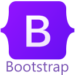
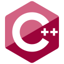

## Hey 👋, I'm Kalpa Kavindu!

I'm a student with talent in various fields such as Full stack web development 🌐, Mobile application development 📱, Graphic design (Beginner Level) 🎨 & Technology 🤖.
 
 

### 🧐 More About Me:
-   🔭 &nbsp; I’m currently working as a **Co-Worker**, **Freelancer** and **Developer**
-   🌱 &nbsp; I’m currently learning Machine Lerning
-   📝 &nbsp; Checkout my [portfolio](https://sites.google.com/view/kalpaonline)
-   💬 &nbsp; Ask me about anything tech related, I am happy to help

 

### 🔨 Languages and Tools:

<!--  -->

 

### 📊 Github Stats

